  

<h3>💻 Full Stack Software Engineer | Web Developer 🌐</h3>

Passionate about building modern, scalable and high-performance web & mobile applications with the Microsoft .NET ecosystem and modern JavaScript frameworks.

---

## 🚀 About Me

- 🔭 I'm currently working on **Full Stack Web Applications**
- 🌱 I'm always learning and exploring **new technologies**
- 💬 Ask me about **.NET, ASP.NET Core, Angular, React, SQL**
- ⚡ Fun fact: I love turning ☕ into clean code!
- 📫 How to reach me: **pavelwahid1@gmail.com**

---

## 🛠️ Tech Stack

### 💎 Backend Development

### 🏛️ Architecture & Patterns

### 🎨 Frontend Development

### 📱 Mobile / Cross-Platform

### 🗄️ Database

### 🧰 Tools & Platforms

---

## 📊 GitHub Statistics

---

## 🏆 GitHub Trophies

---

## 🌐 Connect With Me

---

### 💡 "Code is like humor. When you have to explain it, it's bad." – Cory House

⭐️ From your friendly neighborhood **Full Stack Developer** ⭐️

